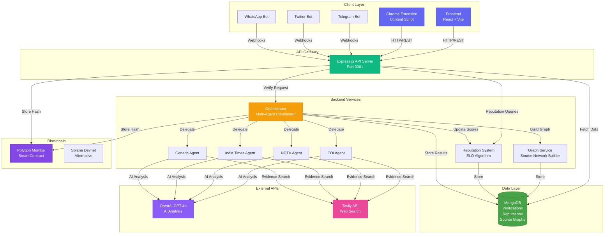
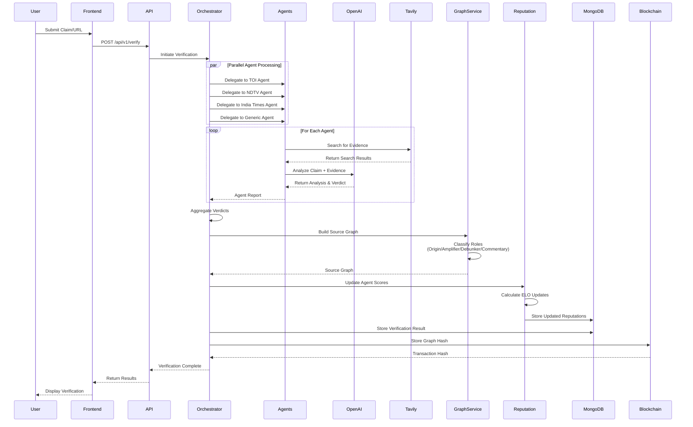

# SatyaTrail — News Authenticity & Trail Explorer

A full-stack news verification platform that traces the origin and propagation of news stories through a network of sources, using AI-powered multi-agent verification, blockchain storage, and an intuitive visualization interface.

## 🌟 Features

### Frontend Features
- **Tile-based Feed**: Browse news articles with veracity badges and dynamic images
- **Source Network Visualization**: Interactive 3D graph showing how stories propagate from origin through amplifiers, debunkers, and commentators
- **Multi-Agent Verification**: ChatGPT-style claim checker with real-time agent responses
- **Agent Rankings**: Leaderboard showing agent reputation scores, accuracy rates, and credibility metrics
- **Source Reputation System**: Each source scored based on historical accuracy and credibility
- **Trail Explorer**: Visualize the complete trail of how a story spread across sources
- **Recent Verifications Sidebar**: Quick access to previously verified claims
- **Neo-Brutalist Design**: Bold, high-contrast UI with newspaper-inspired styling

### Backend Features
- **Multi-Agent Orchestration**: TOI, NDTV, India Times, and Generic agents analyze claims
- **Source Graph Tracing**: Maps how news propagates across sources with role classification
- **Blockchain Storage**: Immutable verification records on Polygon/Solana
- **Reputation System**: ELO-inspired algorithm tracking agent performance over time
- **Tavily Search Integration**: Web search and content extraction for evidence gathering
- **OpenAI GPT Integration**: AI-powered analysis and reasoning
- **Bot Integrations**: Telegram, Twitter/X, and WhatsApp bots for public verification

### Extension Features
- **Full Page Verification**: Analyze entire webpages for misinformation
- **Quick Check**: Verify selected text instantly
- **Detailed Results**: Claim-by-claim verdicts with evidence
- **Evidence Sources**: View supporting evidence from trusted sources

## 🛠️ Tech Stack

### Frontend
- **Framework**: Vite + React.js (JavaScript)
- **Styling**: TailwindCSS with Neo-Brutalism theme
- **UI Kit**: Radix UI primitives + Lucide icons
- **State**: Zustand for global stores + URL search params
- **Forms**: react-hook-form + zod
- **3D Visualization**: Three.js + React Three Fiber
- **Animations**: Framer Motion
- **Notifications**: sonner

### Backend
- **Runtime**: Node.js 18+
- **Framework**: Express.js
- **Database**: MongoDB with Mongoose
- **AI**: OpenAI GPT-4o
- **Search**: Tavily API
- **Blockchain**: Polygon (Mumbai testnet) / Solana (devnet)
- **Bots**: Telegraf, Twitter API v2, Twilio

### Blockchain
- **Network**: Polygon Mumbai / Solana Devnet
- **Smart Contracts**: Solidity (Hardhat)
- **Storage**: Immutable verification hashes on-chain


## 🏗️ Architecture

### System Architecture Diagram



## 🚀 Getting Started

### Prerequisites

- Node.js 18 or higher
- MongoDB (local or cloud)
- API keys for:
  - OpenAI
  - Tavily
  - (Optional) Telegram bot token, Twitter API credentials

### Frontend Setup

```bash
# Install dependencies
npm install

# Run development server
npm run dev

# Build for production
npm run build

# Preview production build
npm run preview
```

The frontend will run on `http://localhost:5173` (or the next available port).

### Backend Setup

```bash
# Navigate to backend directory
cd backend

# Install dependencies
npm install

# Configure environment
cp .env.example .env
# Edit .env with your API keys

# Start MongoDB (if using Docker)
docker-compose up -d mongo

# Run development server (with auto-reload)
npm run dev

# Or run production server
npm start
```

The backend will run on `http://localhost:3001` (or configured port).

### Extension Setup

1. Open Chrome and navigate to `chrome://extensions/`
2. Enable **Developer mode** (toggle in top right)
3. Click **Load unpacked**
4. Select the `extension` folder from this project
5. The SatyaTrail icon should appear in your toolbar

### Verification Flow Diagram



## 🎯 Source Network Role Classification

The system classifies sources in the trail network into four roles:

- **Origin**: The original source where the story first appeared (earliest timestamp)
- **Amplifier**: High-credibility sources that spread the story (high reputation + amplifier signals)
- **Debunker**: Fact-check sources that verify or debunk claims (fact-check domains + debunk signals)
- **Commentary**: Analysis, opinion pieces, and other commentary on the story

Classification uses:
- Backend-provided roles (if available)
- Timestamp analysis (earliest = origin)
- Domain reputation and fact-check domain lists
- Content signals (keywords, language patterns)
- Credibility scores

## 📊 Reputation System

The reputation system uses an ELO-inspired algorithm:

- **Reputation Score**: Base score (1000) adjusted by verification outcomes
- **Accuracy Rate**: Percentage of verifications where agent agreed with consensus
- **Credibility Score**: Average credibility score (0-100) across all verifications
- **Total Verifications**: Count of verifications performed by the agent

Scores are updated after each verification based on:
- Agreement with consensus verdict
- Confidence level of the verification
- Time decay (older verifications have less weight)

## 🔗 Blockchain Integration

Verification results are stored on-chain for immutability:

- **Network**: Polygon Mumbai (testnet) / Solana Devnet
- **Storage**: Graph hash stored on-chain
- **Verification**: Full verification data stored off-chain, hash on-chain
- **Smart Contract**: `SatyaTrail.sol` handles hash storage and retrieval

## 🤖 Multi-Agent System

The platform uses specialized agents for verification:

- **Generic Verification Agent**: General-purpose fact-checking
- **TOI Agent**: Times of India perspective
- **NDTV Agent**: NDTV perspective
- **India Times Agent**: India Times perspective

Each agent:
- Analyzes claims independently
- Provides reasoning and evidence
- Assigns credibility scores
- Contributes to consensus verdict